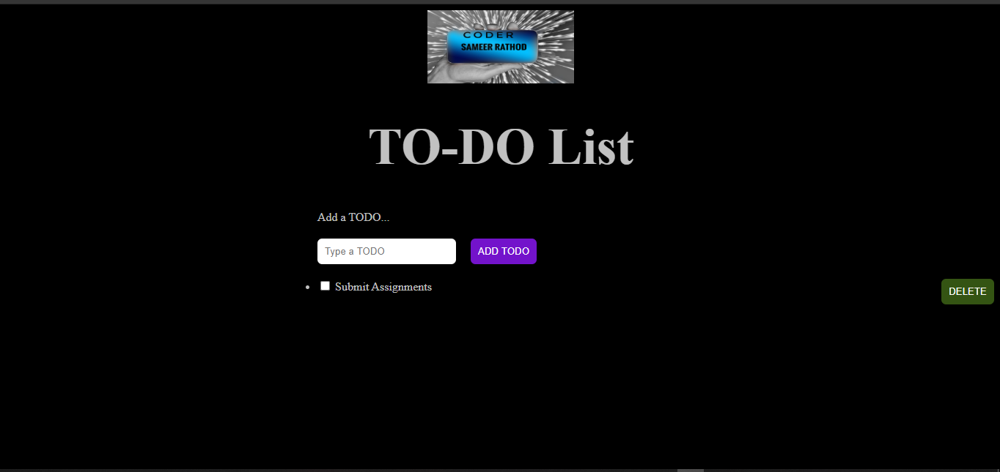

I have Created ToDo application using Angular which allows to add the tasks and user can delete the  task after completion.

How To Run:- 
Step 1) Install the node modules in project Directory use command "npm install" 

Step 2) Install Angular in the project Directory and use all commands from set up section from angular.io setup section to install

Step 3)Then start command prompt and go to project directory

ex. cd Desktop/angularProject/ang

Step 4) To execute and start server use

"ng serve --open" and then start browser and go to http://localhost:4200

Step 5) Type a ToDo in the given section and click Add ToDo Button to add Task 

Step 6) Click on Delete button to delete task after completion.

# Images

